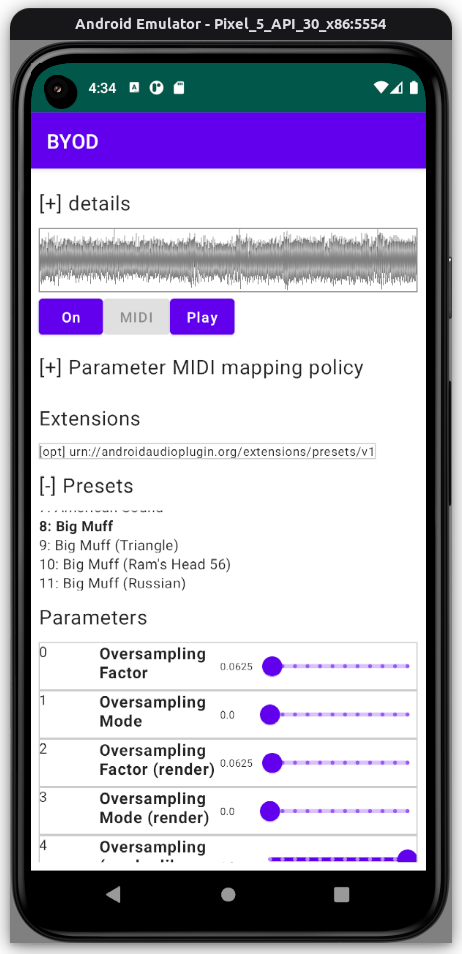

# aap-juce-byod: BYOD on Android

It is a port of [Chowdhury-DSP/BYOD](https://github.com/Chowdhury-DSP/BYOD) to [Audio Plugins for Android](https://github.com/atsushieno/aap-core) using [aap-juce](https://github.com/atsushieno/aap-juce).

## Current issues

- MainActivity fails to launch
  - JuceActivity causes UnsatisfiedLinkError to the JNI symbols that BYOD somehow linked out, unlike other aap-juce apps.
- Basically applying effect is slow. Definitely not for non-static uses so far. 
  - It is most likely it could not make use of optimal processor instructions i.e. SIMD/NEON.
- [Loading the list of presets is slow](https://github.com/atsushieno/aap-juce/issues/34). It could take minutes.

## Licenses

BYOD is distributed under the GPLv3 license.

aap-juce-byod is distributed under the GPLv3 license.

